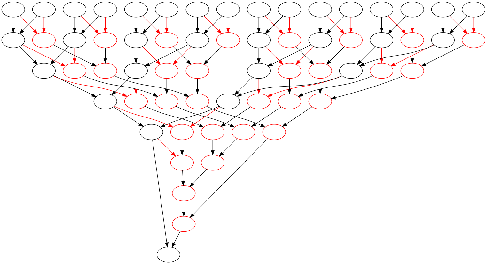
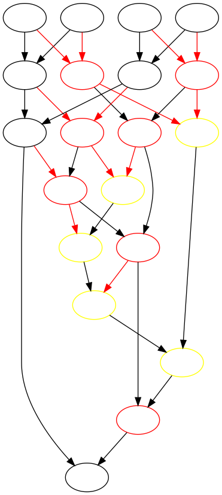

This is showing a way of constructing a tournament graph. It's not necessarily
the best way. The graph has two brackets; the normal bracket and a losers
bracket, effectively giving everyone in the tournament (except one!) the chance
to win even with one loss.

It produces a Graphviz dot file that will produce an image like below. The
black arrows show winners, the red arrows show losers. The black circles are
the normal bracket and the red ones are the loser's bracket.

You can also have an arbitrary number of loser's brackets. Here's three, with
yellow showing the twice-loser's bracket.

